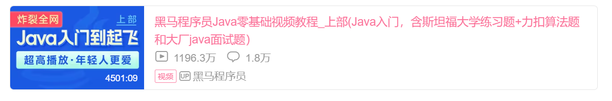
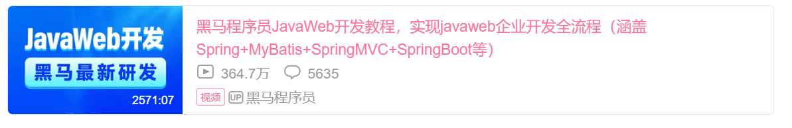
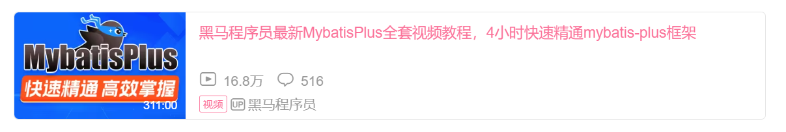
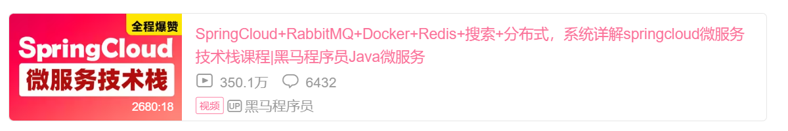
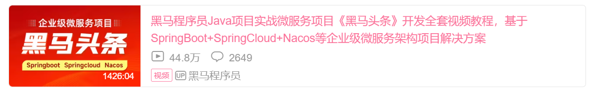
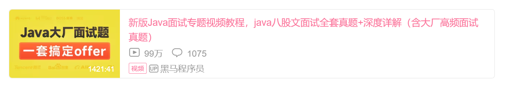
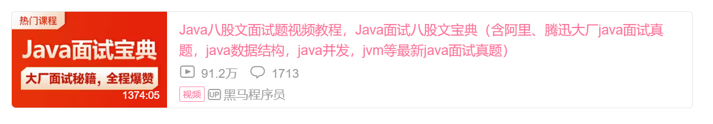

### 本文章按照主流的Java教学视频黑马程序员总结：
```
Java基础 → Javaweb（含SSM框架）→ 苍穹外卖项目 → 微服务 → 黑马头条项目、学成在线项目 → Java大厂面试专题课 
```
# Java学习路线详细介绍:

## 第一阶段：Java基础
Java基础的天花板教程，面向0基础同学，有手就行。从0开始，到进阶，起飞，层层递进。课程中会讲解很多编程思想，以及我是如何从0开始去分析一个问题，并把代码写出来的。拒绝一听就懂，一学就废。 
### Java上部：
[黑马程序员Java零基础视频教程_上部（Java入门，含斯坦福大学练习题+力扣算法题和大厂java面试题）](https://www.bilibili.com/video/BV17F411T7Ao/?vd_source=d7a33feaa3960b442fceb87a398de9fe)

[](https://www.bilibili.com/video/BV17F411T7Ao/?vd_source=d7a33feaa3960b442fceb87a398de9fe)
### Java下部：
[黑马程序员Java零基础视频教程_下部(Java入门，含斯坦福大学练习题+力扣算法题和大厂java面试题）](https://www.bilibili.com/video/BV1yW4y1Y7Ms/?vd_source=d7a33feaa3960b442fceb87a398de9fe)

[](https://www.bilibili.com/video/BV1yW4y1Y7Ms/?vd_source=d7a33feaa3960b442fceb87a398de9fe)

## 第二阶段：Java Web框架
学前导读：本阶段深入讲解JavaWeb核心技术，学完本阶段课程可以制作中小型网站和企业管理系统等。

### JavaWeb（包含Tomcat、MySQL、Servlet、Spring、SpringMVC、Mybatis、SpringBoot、Maven...）

2023年最新版JavaWeb，基于主流的前后端分离的开发模式进行设计和讲解，基于主流的SpringBoot来讲解整个Web开发的知识点，参照企业开发模式，需求分析-表结构设计-接口文档-功能接口实现-测试-联调，理论与实践相结合，通过案例贯穿整个课程体系，学以致用。 

[黑马程序员JavaWeb开发教程，实现JavaWeb企业开发全流程（涵盖Spring+MyBatis+SpringMVC+SpringBoot等）](https://www.bilibili.com/video/BV1m84y1w7Tb/)

[](https://www.bilibili.com/video/BV1m84y1w7Tb/)

## 第三阶段：单体项目开发

学前导读：通过单体项目开发，把前面的所学全部综合应用，提升真实的项目需求分析能力、接口设计能力、编码能力、代码调试能力、文档阅读能力

### 苍穹外卖
本课程采用理论与实践并重的方式，讲练结合，适合具有一定java基础、了解java web、spring、mybatis、mysql、maven的初学者，可以帮助学员更牢固地对所学知识进行掌握
。
[黑马程序员Java项目实战《苍穹外卖》，最适合新手的SpringBoot+SSM的企业级Java项目实战](https://www.bilibili.com/video/BV1TP411v7v6/?vd_source=d7a33feaa3960b442fceb87a398de9fe)

[](https://www.bilibili.com/video/BV1TP411v7v6/?vd_source=d7a33feaa3960b442fceb87a398de9fe)

## 第四阶段：微服务

学前导读：本阶段汇集了当下热门的微服务框架，学完后可增加中级程序员的知识储备，为面试或将来技术的深入奠定良好的基础。

### 1.MybatisPlus全套视频教程

[《MybatisPlus》是目前企业开发中最常用的基础框架之一。它可以大大简化我们的单表CRUD，在Mybatis的基础上，只做增强，不做修改。学会了MybatisPlus的使用，绝对能让你的开发效率大大提升。](https://www.bilibili.com/video/BV1Xu411A7tL/)

[](https://www.bilibili.com/video/BV1Xu411A7tL/)

### 2.Java全套微服务技术栈课程，学完这套就够了

[课程将Spring Cloud Alibaba、RabbitMQ、Docker、Redis、Elasticsearch等众多行业大厂技术一网打尽，稳固掌握，逐层提高！通过实用篇的学习就能掌握解决企业中常见的问题，通过进阶篇的学些掌握难点、痛点，最后的面试篇助力解决面试难题。](https://www.bilibili.com/video/BV1LQ4y127n4/?vd_source=d7a33feaa3960b442fceb87a398de9fe)

[](https://www.bilibili.com/video/BV1LQ4y127n4/?vd_source=d7a33feaa3960b442fceb87a398de9fe)

## 第五阶段：企业级项目实战

学前导读：“项目经验”是企业了解人才能力的关键因素，为了更快更好地进入企业，就要选择真实、可靠、紧跟企业需要的项目课，沉浸不同阶段和规模的项目实战。

传智研究院自2016年起，每年持续投入课程研发资金以亿为单位计算，所研发项目库行业规模大，单个项目业务完整，符合实际开发场景和业务需要。项目库覆盖19个行业场景，累计研发34个大型项目。

项目课能快速帮助学员获取行业经验，掌握核心业务需求及应对方案，以下项目课根据自己情况选择学习，学习结束后可拥有同行业2-3年的项目经验。 

### 1.学成在线【在线教育】

[以在线教育业务为基础，基于当前热门的 Spring Cloud 微服务技术栈进行设计，采用Nginx、SpringBoot、Spring Cloud、MyBatis-Plus、MQ、Redis、Elasticsearch等框架和中间件为基础进行开发，带领学员体验Java大型项目从需求分析、架构设计、编码、调试、测试的整个过程。](https://www.bilibili.com/video/BV1j8411N7Bm)

[](https://www.bilibili.com/video/BV1j8411N7Bm)

### 2.黑马头条【企业级微服务项目】

[《黑马头条》项目采用的是SpringBoot+springcloud当下最流行的微服务为项目架构，配合spring cloud alibaba nacos作为项目的注册和配置中心。新课程采用快速开发的模式，主要解决真实企业开发的一些应用场景。深入挖掘技术和业务的解决方案，做到更加的通用，能举一反三，充分满足互联网行业中复杂的微服务技术要求。](https://www.bilibili.com/video/BV1Qs4y1v7x4)


[](https://www.bilibili.com/video/BV1Qs4y1v7x4)

## 第六阶段  面试专题课

学前导读：以100+企业大厂真实高频Java面试真题为主干，轻松应对大厂面试。

### 1.2023版Java大厂面试专题

[Java面试专题课解决面试过程中的一些常见问题，本阶段课程全面覆盖重难点面试题。包含了多个模块的面试题讲解，如：Redis、MySQL、框架、微服务、消息中间件、数据结构、Java集合源码分析、多线程、JVM、设计模式、高并发场景、企业实际问题场景等等各个方面逐一讲解。](https://www.bilibili.com/video/BV1yT411H7YK)

[](https://www.bilibili.com/video/BV1yT411H7YK)

### 2.2021版Java大厂面试专题

[java面试宝典（含阿里、腾迅大厂java面试真题，java数据结构，java并发，jvm等最新java面试真题等），以数据结构的可视化展示、算法的可视化展示，窥探底层的工具使用等等可视化手段，用最直观、形象的方式展现复杂的知识内容，让学生更清晰、更容易地掌握这些Java面试题与Java知识点。](https://www.bilibili.com/video/BV15b4y117RJ)

[](https://www.bilibili.com/video/BV15b4y117RJ)

<h2><font color = red>学完以上技术，足以支撑找一份好的java开发工作。</font></h2>

## 如想工作后再提升，还可以点击下面的技术点进行学习：

 jdk8-10，jdk13，jdk14，jdk15 ，Dubbo，zookeeper，RabbitMQ，RocketMQ，容器化Docker，NoSQL技术Redis，MongoDB；Elastic stack，Lucene，Solr，Maven，Git，SSM，Spring高级，Springboot，Java数据机构与算法，实战JVM，Java百度地图，Java设计模式，JUC并发编程，网络编程Netty，MySQL，Oracle，SpringData高级，Java日志框架，安全框架ApacheShiro，Elastic-Job，分布式事务，Nginx，Java可视化报表，模板引擎VelocityTools，工作流Activiti7，百度地图技术，SpringSecurity，Spring Security OAuth2.0认证授权，支付技术（支付宝、微信），持续集成Jenkins，

## 更多的企业级项目练习

瑞吉外卖【服务行业】，传智健康【医疗行业】，SaaSiHRM【企业服务】，好客租房【生活服务】，权限管理一体化解决方案，短信网关平台 