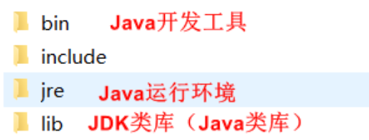
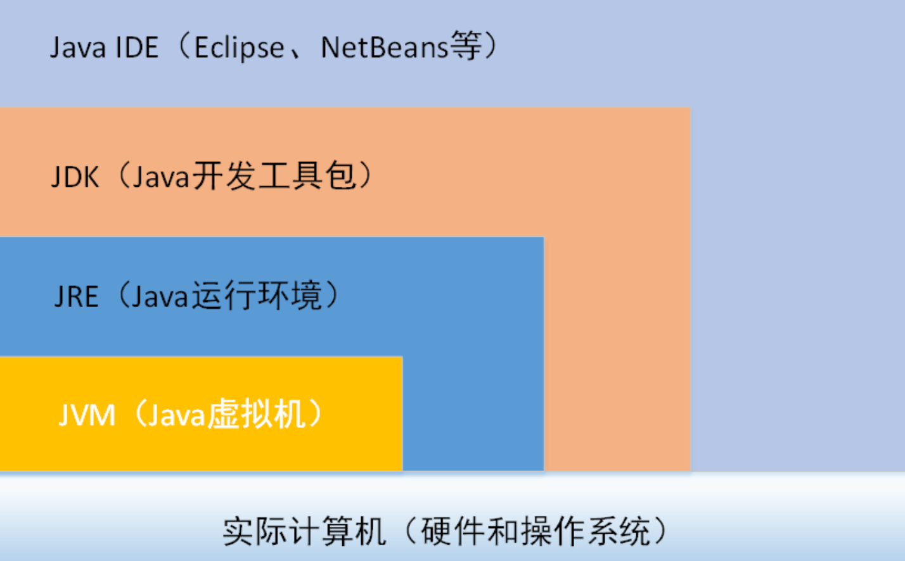

# 认识JDK，JVM和JRE：

## JDK（Java Development Kit）

### 一、简介：
#### <font color="red">JDK（Java Development Kit，Java开发工具包）</font>
JDK为Java应用程序提供了基本的开发和运行环境，是整个Java的核心，包括：
1. Java运行环境（JRE）
2. JDK类库，如：java.lang、java.io、java.awt、java.swing等类
3. Java开发工具，如：javac.exe（编译工具）、java.exe（运行工具）、javadoc.exe（生成JavaDoc文档的工具）和jar.exe（打包工具）等  

Java安装包中的对应关系（如图所示）:


#### <font color="red">JRE（Java Runtime Environment，Java运行环境）</font>
JRE是Java程序的运行环境，包含：JVM和Java核心类库

```
当下发一个Java程序时，想要在一个全新的环境下运行一个Java程序只需要安装JRE就可以
```

#### <font color="red">JVM（Java Virtual Machine，Java虚拟机）</font>

JVM即Java虚拟机，是整个Java实现跨平台的最核心的部分，是编译后的Java程序（.class文件）和硬件系统的接口，不仅解释执行编译后的Java指令，而且还进行安全检查

#### 三者关系：
JDK = JRE + 其他
JRE = JVM + 其他

### 图解
以下是JDK，JRE和JVM三者的关系图



以上就是上述三者的关系概述！还请指正！