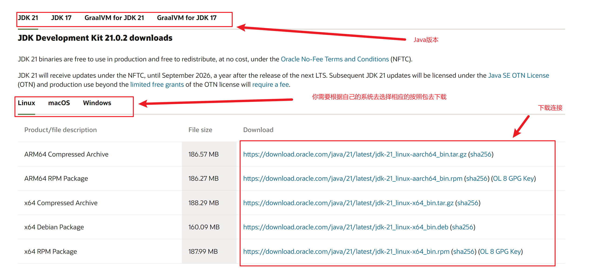
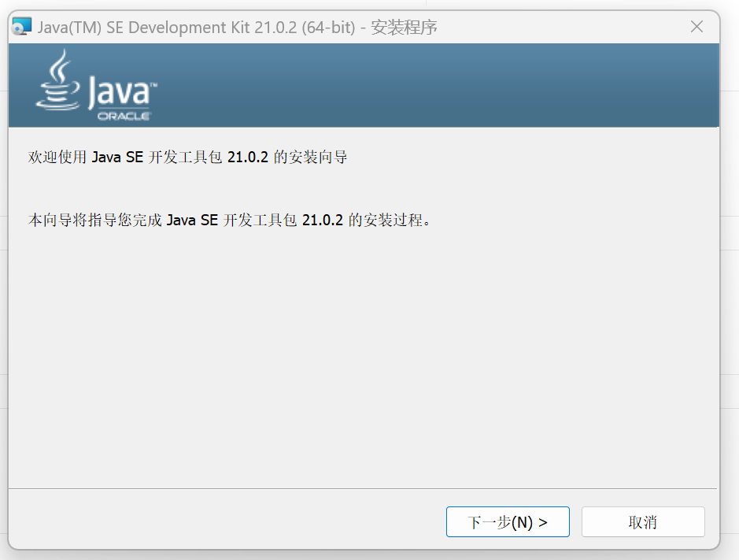
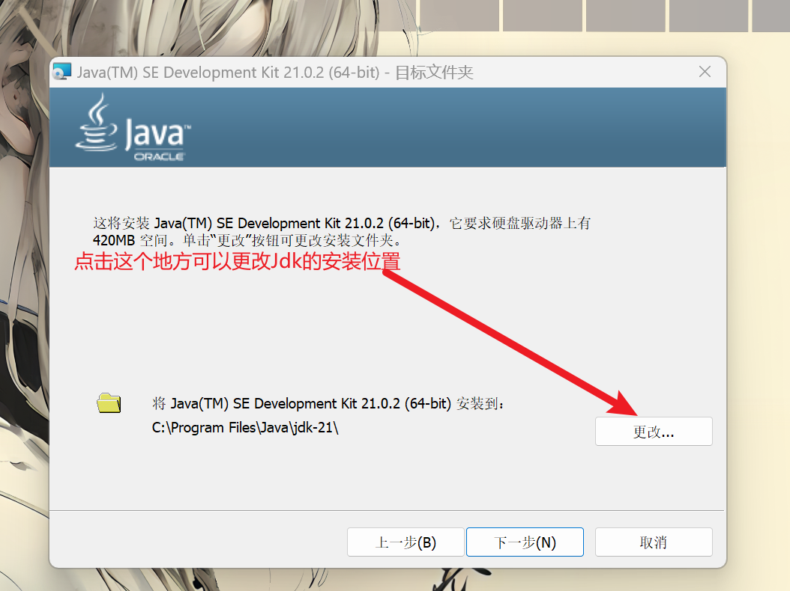
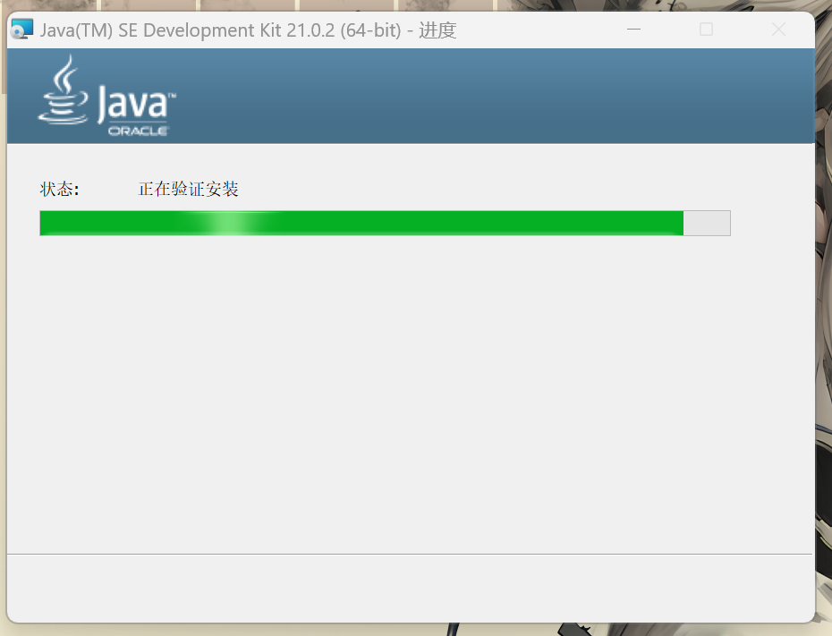
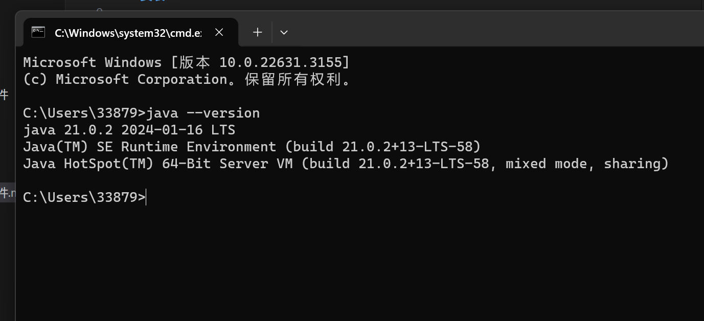
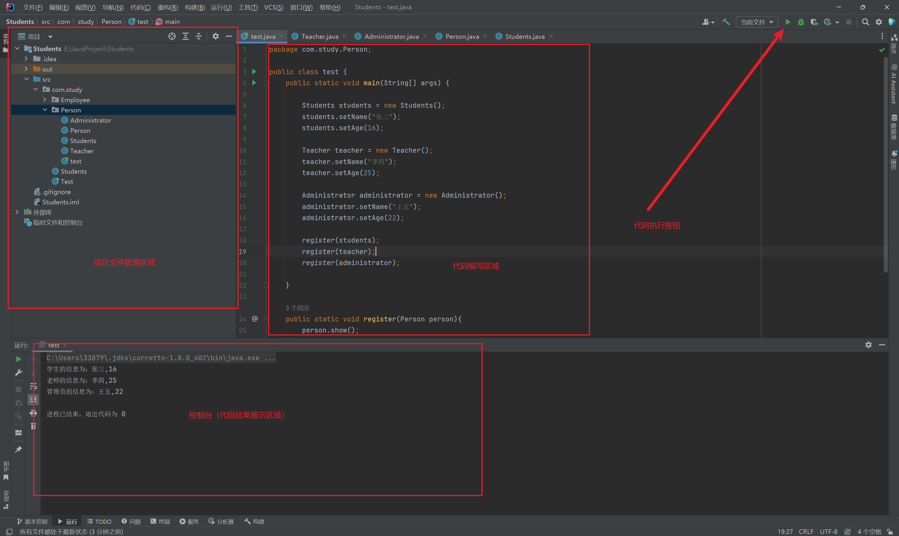

# 安装Jdk

## 1.下载Jdk
想要下载jdk，我们一定要去甲骨文官网下载，防止从其他地方下载到流氓软件。请浏览器访问以下地址去[下载](https://www.oracle.com/cn/java/technologies/downloads/)(你也可以置界点击蓝色的下载字体去跳转到官网)：

```
https://www.oracle.com/cn/java/technologies/downloads/
```


我用的是Windows系统，所以如果你和我一样的话可以按照我的方式来安装。

## 2.安装Jdk

首先我们找到Java的安装包双击打开它

点击下一步

在这里你可以按照你的需求更改你的安装位置，完成后点击下一步

等待安装完成即可

### 3.验证是否安装完成

我们安装完jdk之后一般都需要验证是否安装成功，接下来是验证步骤
1) 按下键盘上的win+R键，打开运行，然后输入CMD打开控制台

2) 在黑窗口输入 Java --version查看JDK版本

3) 如果你的显示结果与我的类似那么祝贺你安装成功

## 安装Idea

### 下载idea
我们刚才下载了jdk已经可以编写Java程序了，但是编写方式太原始了，效率十分的底下，所以我推荐使用idea来帮助大家提高代码的编写效率
1) 首先我们去访问官网下载,下面是idea community版本的下载地址
```
https://www.jetbrains.com/zh-cn/idea/download/?section=windows
```
2) 接下来我们就可以安装我们所需要的版本了

3) 接下来就是很傻瓜式的操作了，大家直接按照自己的喜好按装即可。

### idea简介
一张图片给大家解释清楚idea界面


## 致谢
上述就是JDK以及idea的详细安装过程了如果你有什么问题请在下方的评论区随时题问！